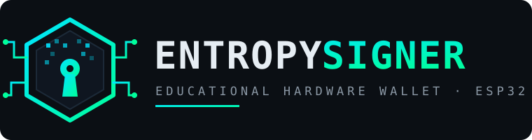
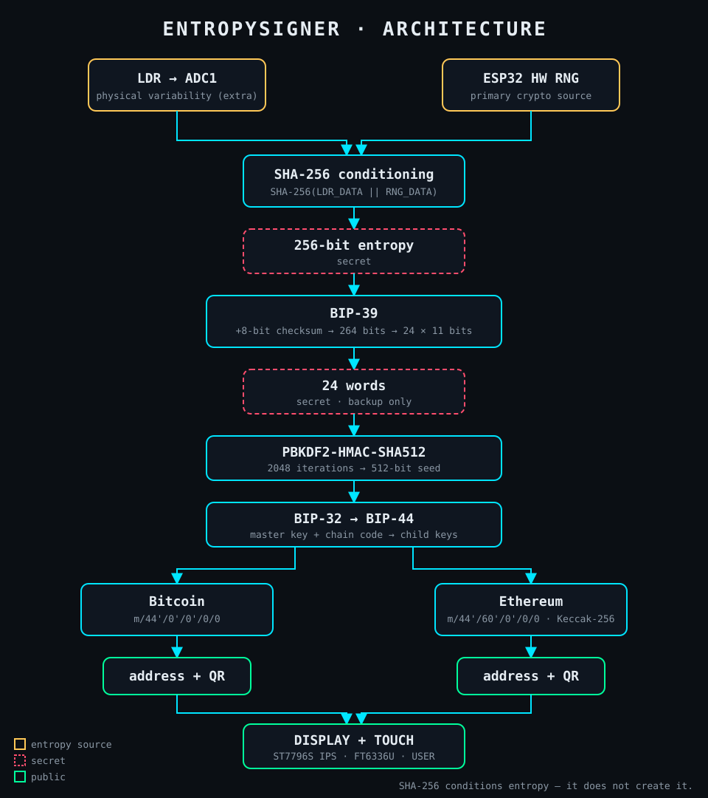
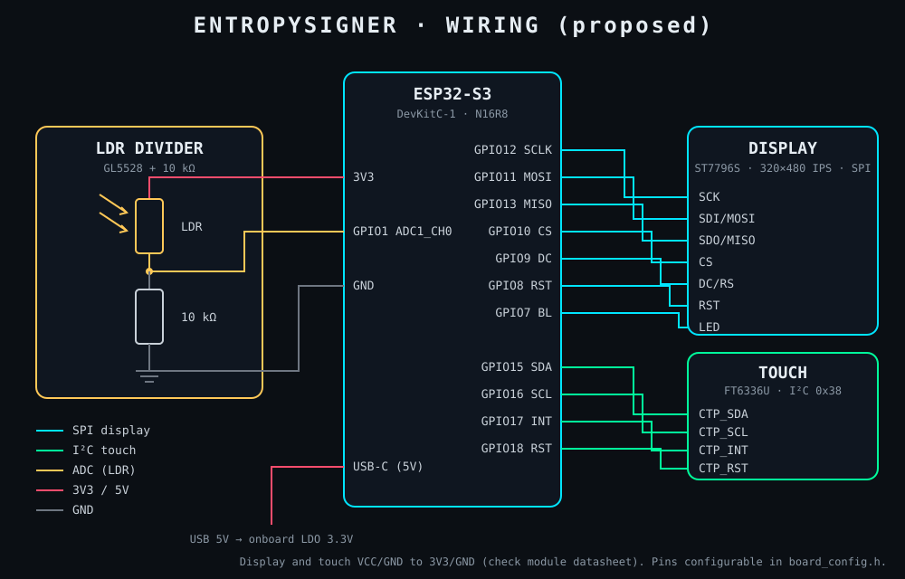

<p align="center">
  
</p>

# 🔐 EntropySigner

## ESP32 Educational Hardware Wallet

> **Open-source ESP32 hardware wallet prototype exploring physical entropy, hardware random generation, BIP-39 and hierarchical wallet derivation.**

**Descripción académica:** Diseño e implementación de un prototipo de Hardware
Wallet basado en ESP32 para el estudio de generación de entropía, BIP-39,
derivación jerárquica de claves y gestión de direcciones para Bitcoin y Ethereum.

> ⚠️ **Educational Hardware Wallet Prototype.** EntropySigner no es una
> hardware wallet comercial ni auditada. **No usar con fondos reales.**
> Inspiración conceptual: proyectos open-source como SeedSigner; la
> implementación, el diseño y la identidad de EntropySigner son propios.

---

## Features

| Feature | Descripción | Estado |
|---|---|---|
| ESP32 | ESP32-S3 con PSRAM y USB nativo | ✅ Firmware base |
| Physical entropy | LDR leído por ADC1 como fuente adicional | Pendiente |
| Hardware RNG | RNG de hardware del ESP32 como fuente principal | Pendiente |
| SHA-256 | Acondicionamiento de entropía y checksum BIP-39 | Pendiente |
| BIP-39 | Mnemonic de 24 palabras + validación + seed | Pendiente |
| BIP-32 | Derivación jerárquica de claves | Pendiente |
| BIP-44 | Rutas estándar multi-moneda | Pendiente |
| ₿ Bitcoin | `m/44'/0'/0'/0/0` | Pendiente |
| Ξ Ethereum | `m/44'/60'/0'/0/0` + Keccak-256 | Pendiente |
| Touch UI | Pantalla IPS táctil con navegación | Driver inicial |
| QR codes | Sólo direcciones públicas de recepción | Pendiente |
| Entropy analysis | Herramientas Python, metodología NIST SP 800-90B | Pendiente |

---

## Architecture

<p align="center">
  
</p>

```
LDR ──► ADC ──► LDR DATA ─┐
                          ├──► SHA-256 (conditioning) ──► 256 bits
        ESP32 HW RNG ─────┘

256 bits ──► SHA-256 ──► 8-bit checksum ──► 264 bits ──► 24 × 11 bits ──► 24 words

24 words ──► PBKDF2-HMAC-SHA512 (2048) ──► 512-bit seed ──► BIP-32 ──► BIP-44
                                                                         │
                          ┌──────────────────────────────────────────────┤
                          │                                              │
                 Bitcoin m/44'/0'/0'/0/0                     Ethereum m/44'/60'/0'/0/0
                          │                                              │
                   address ──► QR                                 address ──► QR
```

**Principio de seguridad:** la fuente criptográfica principal es el **RNG de
hardware del ESP32**. El **LDR es una fuente física adicional** de variabilidad;
no se afirma que aporte 256 bits. **SHA-256 no crea entropía**: acondiciona los
datos y oculta estructura, pero no puede convertir una fuente pobre en una rica.

Detalle: [`docs/ARCHITECTURE.md`](docs/ARCHITECTURE.md)

---

## Hardware

| Componente | Propuesta |
|---|---|
| MCU | ESP32-S3-DevKitC-1 (N16R8) |
| Display | 3.5"–4.0" IPS · ST7796S · 320×480 · SPI |
| Touch | Capacitivo FT6336U · I²C |
| Entropía física | LDR GL5528 + 10 kΩ (divisor) → GPIO1 / ADC1_CH0 |
| Alimentación | USB-C 5 V → LDO 3.3 V |

<p align="center">
  
</p>

Detalle, pinout, BOM y alternativas: [`docs/HARDWARE.md`](docs/HARDWARE.md)

---

## Project Status

- [x] Paso 0 — Hardware analysis
- [x] Paso 1 — Project foundation
- [ ] Paso 2 — Display
- [ ] Paso 3 — Touchscreen
- [ ] Paso 4 — LDR
- [ ] Paso 5 — Hardware RNG
- [ ] Paso 6 — Entropy conditioning
- [ ] Paso 7 — SHA-256
- [ ] Paso 8 — BIP-39
- [ ] Paso 9 — Mnemonic validation
- [ ] Paso 10 — PBKDF2
- [ ] Paso 11 — BIP-32
- [ ] Paso 12 — Bitcoin
- [ ] Paso 13 — Ethereum
- [ ] Paso 14 — QR
- [ ] Paso 15 — Wallet UI
- [ ] Paso 16 — Seed backup
- [ ] Paso 17 — Entropy analysis
- [ ] Paso 18 — Cryptographic tests
- [ ] Paso 19 — Security hardening
- [ ] Paso 20 — Final documentation
- [ ] Paso 21 — Presentation

### Criterios de finalización

- [ ] Hardware documentado *(propuesto; falta confirmar el hardware comprado)*
- [ ] ESP32 funcionando *(firmware compila; falta probar en placa)*
- [ ] Display funcionando
- [ ] Touch funcionando
- [ ] LDR funcionando
- [ ] RNG funcionando
- [ ] Entropy pipeline funcionando
- [ ] SHA-256 validado
- [ ] BIP-39 validado
- [ ] 24 words funcionando
- [ ] Checksum funcionando
- [ ] PBKDF2 funcionando
- [ ] BIP-32 funcionando
- [ ] BIP-44 funcionando
- [ ] Bitcoin funcionando
- [ ] Ethereum funcionando
- [ ] QR funcionando
- [ ] UI funcionando
- [ ] Recovery flow funcionando
- [ ] Entropy analysis funcionando
- [ ] Tests completos
- [ ] Security review
- [ ] README completo
- [ ] Diagramas *(arquitectura y conexiones creados; faltan BIP-39, derivación y sistema completo)*
- [ ] Presentación
- [ ] Guion de exposición
- [ ] Referencias
- [ ] Limitaciones documentadas

---

## Repository structure

```
EntropySigner/
├── README.md · LICENSE · .gitignore · .editorconfig
├── platformio.ini              envs esp32s3-demo / esp32s3-prod
├── firmware/esp32/             particiones, config de placa, scripts de flasheo
├── src/
│   ├── main.cpp                arranque: Serial, display, touch, BOOT OK
│   ├── config/                 build_config.h · board_config.h · pin_rules.h
│   ├── security/               secure_log.h (política de logs por modo)
│   ├── system/                 device_info (chip, flash, PSRAM)
│   ├── ui/                     LovyanGFX (ST7796S + FT6336U), boot screen
│   └── entropy/ crypto/ bip39/ bip32/ bitcoin/ ethereum/ qr/
├── tests/                      Unity (test_foundation en dispositivo)
├── tools/
│   ├── entropy_analysis/       captura y análisis LDR (Python)
│   └── verification/           verificación cruzada (Python)
├── docs/                       HARDWARE, ARCHITECTURE, ENTROPY, BIP39, ...
├── hardware/                   schematic/ · pcb/ · enclosure/
├── presentation/               slides, speaker notes, assets
└── assets/                     logo.svg · architecture.svg · circuit.svg
```

---

## Installation

1. Instalar PlatformIO: extensión **PlatformIO IDE** o
   `python -m pip install --user platformio`.
2. Abrir la carpeta del proyecto desde una **ruta local** (p. ej. `D:\...`), no
   desde la ruta de red `\\Criptoaprendices\d\...`: con rutas UNC el compilador
   no encuentra los fuentes.
3. Compilar: `python -m platformio run` (entorno `esp32s3-demo` por defecto).
4. Flashear: `python -m platformio run -t upload`; monitor serie con
   `python -m platformio device monitor` (115200 baudios).

Placa N16R8: ver el comentario en `platformio.ini` para habilitar 16 MB de flash y PSRAM.

## Usage

| Entorno | Uso |
|---|---|
| `esp32s3-demo` | Desarrollo y demostraciones. Banner **DEMO MODE** en pantalla, logs de depuración. |
| `esp32s3-prod` | Sin logs de depuración (se eliminan del binario), sin banner demo. |

---

## Development Steps (bitácora)

### Paso 0 — Hardware analysis

**Objetivo.** Inspeccionar el proyecto y el entorno, definir hardware y
arquitectura, y crear la estructura inicial del repositorio. Sin código de wallet.

**Implementación.**

- Inspección del workspace: vacío, sin código, sin Git, sin framework.
- Inspección del entorno: Git 2.55 y Python 3.13.7 instalados; PlatformIO no
  instalado; ningún ESP32 conectado por USB.
- Hardware propuesto: ESP32-S3-DevKitC-1 + display IPS ST7796S 320×480 SPI con
  touch capacitivo FT6336U + LDR GL5528 con divisor de 10 kΩ en GPIO1 (ADC1).
- Framework elegido: **PlatformIO + Arduino (ESP32)**, con acceso a las APIs de ESP-IDF.
- Arquitectura en capas; los módulos criptográficos serán independientes de
  Arduino para poder testearlos contra vectores oficiales.
- Hallazgo de diseño: en ESP32-S3 la fuente de entropía interna del RNG (sin
  radio) usa el SAR ADC, así que el muestreo del LDR y la lectura del RNG deben
  **secuenciarse** (se valida en el Paso 5).
- Hallazgo de entorno: el proyecto está en una ruta de red UNC con espacios; la
  terminal y el compilador no funcionan de forma confiable ahí. Se trabaja por
  la ruta local `D:\...`. Se agregó `.editorconfig` (UTF-8, LF).
- Identidad visual inicial (logo) y diagramas de arquitectura y de conexiones.

**Archivos creados.** `README.md`, `LICENSE`, `.gitignore`, `.editorconfig`,
`docs/HARDWARE.md`, `docs/ARCHITECTURE.md`, `assets/logo.svg`,
`assets/architecture.svg`, `assets/circuit.svg`, y `.gitkeep` en las carpetas de
la estructura.

**Cómo probar.** Abrir los SVG de `assets/` en el navegador; revisar
`docs/HARDWARE.md` y confirmar el hardware a comprar.

**Resultado.** Estructura y documentación base creadas; archivos en UTF-8 y SVG
verificados como XML bien formado.

**Commit.** `docs: add hardware analysis and system architecture`

### Paso 1 — Project foundation

**Objetivo.** Firmware mínimo que compile, inicialice Serial, display y touch
(si están conectados) y muestre `ENTROPYSIGNER` / `BOOT OK`, con estructura modular.

**Implementación.**

- `platformio.ini` con plataforma y bibliotecas en versiones fijas:
  `espressif32@6.9.0` (Arduino-ESP32 2.0.17 sobre ESP-IDF 4.4), `LovyanGFX@1.1.16`,
  `Unity 2.6.1`. Dos entornos: `esp32s3-demo` (por defecto) y `esp32s3-prod`.
- `config/build_config.h`: nombre, versión `0.1.0` y modo. Exige exactamente uno
  de `ES_MODE_DEMO` / `ES_MODE_PRODUCTION` (error de compilación si no).
- `config/pin_rules.h` + `config/board_config.h`: pinout de `docs/HARDWARE.md`
  con `static_assert` que impiden usar pines de strapping, USB o flash/PSRAM, y
  que obligan a que el LDR esté en ADC1.
- `security/secure_log.h`: `ES_LOG_INFO` (siempre) y `ES_LOG_DEBUG` (eliminado
  del binario en PRODUCTION).
- `system/device_info`: chip, núcleos, frecuencia, flash y PSRAM por Serial.
- `ui/lgfx_device.h` + `ui/display`: driver LovyanGFX para ST7796S por SPI. El
  touch FT6336U se detecta por I²C (reset + probe en `0x38`) y sólo se registra
  si responde. Pantalla de arranque con banner **DEMO MODE** en modo demo.
- WiFi y Bluetooth no se inicializan (el firmware no incluye esas bibliotecas).

**Archivos creados/modificados.** `platformio.ini`, `src/main.cpp`,
`src/config/build_config.h`, `src/config/board_config.h`,
`src/config/pin_rules.h`, `src/security/secure_log.h`,
`src/system/device_info.h`, `src/system/device_info.cpp`,
`src/ui/lgfx_device.h`, `src/ui/display.h`, `src/ui/display.cpp`,
`tests/test_foundation/test_main.cpp`, `README.md`, `docs/ARCHITECTURE.md`.

**Cómo probar.**

Sin hardware (compilación):

```powershell
python -m platformio run -e esp32s3-demo
python -m platformio run -e esp32s3-prod
python -m platformio test -e esp32s3-demo --without-uploading --without-testing
```

Con la ESP32-S3 conectada al puerto **UART/COM** de la DevKitC-1:

```powershell
python -m platformio run -e esp32s3-demo -t upload
python -m platformio device monitor
python -m platformio test -e esp32s3-demo      # 5 tests en el dispositivo
```

Salida esperada por Serial:

```
[ES] ENTROPYSIGNER v0.1.0
[ES] SECURE HARDWARE WALLET | ESP32 | mode: DEMO
[ES] Initializing...
[ES] Chip: ESP32-S3 rev 0, 2 cores @ 240 MHz
[ES] Display: initialized
[ES] Touch: detected (FT6336U @ 0x38)     <- "not detected" si no hay touch
[ES] BOOT OK
```

Con el display cableado se ve la pantalla de arranque (ENTROPYSIGNER, SECURE
HARDWARE WALLET, ESP32-S3, BOOT OK). Si los colores salen invertidos, compilar
con `-DES_DISPLAY_INVERT=1`.

**Resultado.**

| Verificación | Resultado |
|---|---|
| Build `esp32s3-demo` | ✅ RAM 6.3 % · Flash 11.4 % |
| Build `esp32s3-prod` | ✅ RAM 6.2 % · Flash 10.9 % |
| Build de `test_foundation` | ✅ compila; ejecución pendiente de hardware |
| Mensajes de depuración ausentes en PRODUCTION | ✅ verificado en `firmware.bin` |
| Warnings propios (`-Wall -Wextra`) | 0 (único warning: `REG_SPI_BASE`, interno de LovyanGFX) |
| Prueba en placa física | ⏳ pendiente (no hay ESP32 conectado) |

**Commit.** `feat: initialize EntropySigner firmware`

---

## Security

Principios y modelo de amenazas preliminar en
[`docs/ARCHITECTURE.md`](docs/ARCHITECTURE.md). `docs/SECURITY.md` se crea en el Paso 19.

## Limitations

- Prototipo académico, **no auditado**; no usar con fondos reales.
- Sin protección contra ataques físicos (side-channel, glitching, lectura de flash).
- El LDR no se considera fuente criptográfica suficiente por sí mismo.

## Academic Context

Proyecto de la materia **Criptografía y Seguridad** (2026, 2.º semestre).

## License

[MIT](LICENSE)
